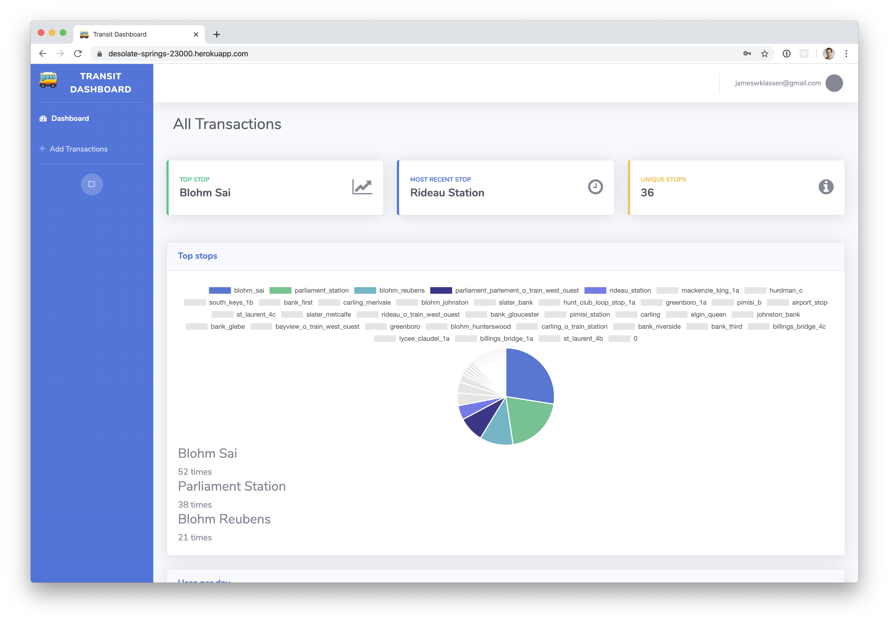
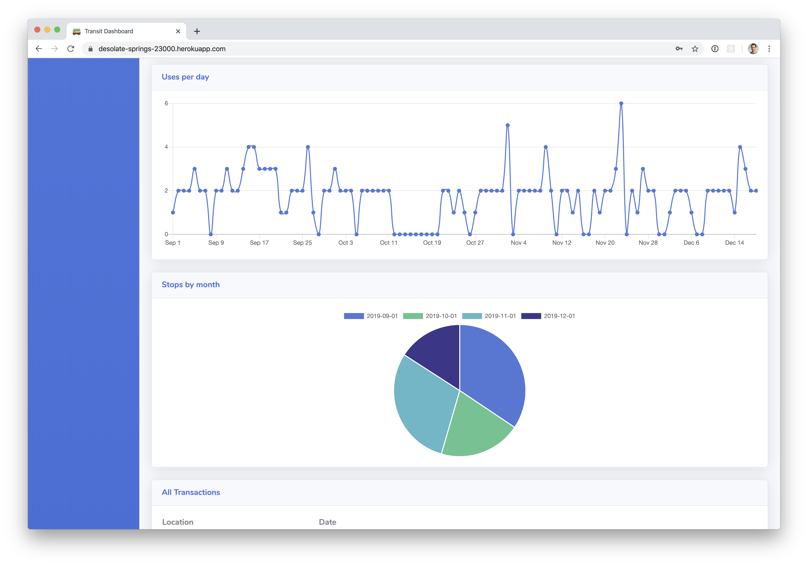

# transit-dashboard 🚌

A way to visualize CSV public transit data on a dashboard with stats.

## Table of Contents
- [Introduction](#introduction)
  - Getting Started
  - 


## Introduction




## Installation

### Getting Started

To start, clone the repository and navigate to it.

```sh
# Clone the repository
git clone git@github.com:jameswklassen/transit-dashboard.git
cd transit-dashboard
```


Once navigated to the repository run `bundle install && yarn install` to install all necessary dependencies.

### Database

To initialize the database, run
```sh
rake db:schema:load
```